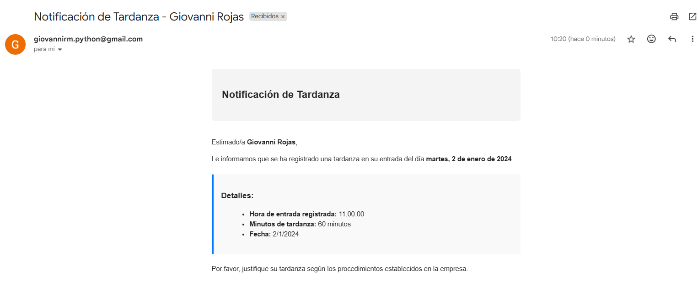
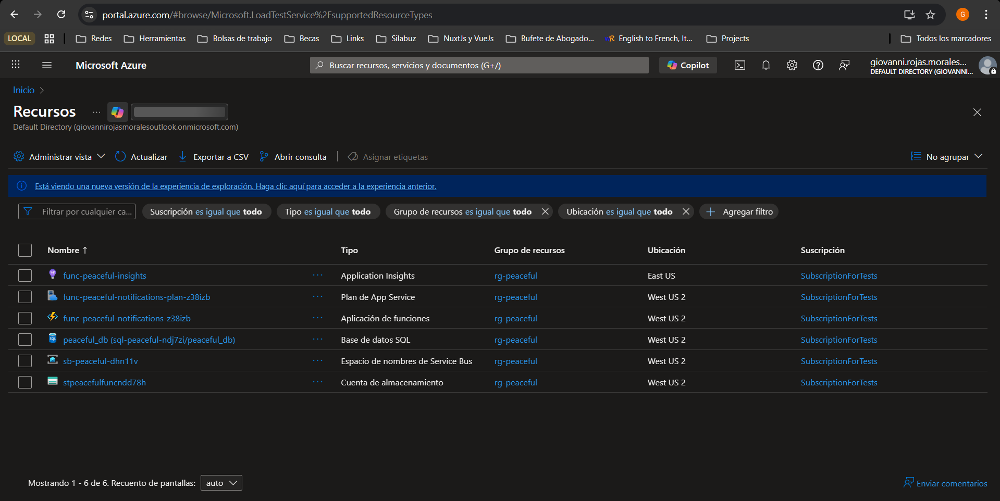
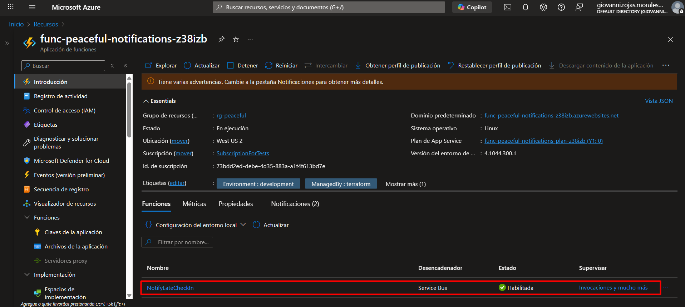

# Azure Function - Notificaciones de Tardanzas

Esta Azure Function procesa mensajes de notificaciones de tardanzas desde Azure Service Bus y envía emails a los empleados.

## Estructura

```
azure-functions/
├── NotifyLateCheckIn/
│   ├── function.json      # Configuración del trigger Service Bus
│   └── index.ts           # Lógica de la función
├── shared/
│   ├── services/
│   │   └── email.service.ts
│   └── constants/
│       ├── email.constants.ts
│       └── error-messages.constants.ts
├── dist/                  # Código compilado (generado)
├── host.json              # Configuración global de la Function App
├── package.json           # Dependencias
├── tsconfig.json          # Configuración de TypeScript
└── README.md              # Este archivo
```

**Nota**: Esta Function usa el **Programming Model v3** de Azure Functions, que es estable y bien documentado. Cada función tiene su propia carpeta con `function.json` para la configuración del trigger.

## Desarrollo Local

### Prerrequisitos

1. **Azure Functions Core Tools**:
   ```bash
   npm install -g azure-functions-core-tools@4 --unsafe-perm true
   ```

2. **Node.js** 20.x o superior

### Configuración

1. **Instalar dependencias**:
   ```bash
   cd azure-functions
   npm install
   ```

2. **Configurar variables de entorno local**:
   Crea un archivo `local.settings.json` basado en `local.settings.json.example`:
   ```json
   {
     "IsEncrypted": false,
     "Values": {
       "AzureWebJobsStorage": "UseDevelopmentStorage=true",
       "FUNCTIONS_WORKER_RUNTIME": "node",
       "SERVICE_BUS_CONNECTION_STRING": "Endpoint=sb://...",
       "SERVICE_BUS_QUEUE_NAME": "late-checkin-notifications",
       "EMAIL_USER": "your-email@gmail.com",
       "EMAIL_APP_PASSWORD": "your-app-password-here"
     }
   }
   ```
   
   **Nota**: `EMAIL_USER` y `EMAIL_APP_PASSWORD` son necesarios para el envío de correos usando nodemailer con Gmail.

3. **Compilar TypeScript**:
   ```bash
   npm run build
   ```

4. **Ejecutar localmente**:
   ```bash
   npm start
   ```

## Despliegue

### Opción 1: Desde Terraform (Automático)

La Function App se crea automáticamente con Terraform. Para desplegar el código:

```bash
# 1. Compilar el código
cd azure-functions
npm install
npm run build

# 2. Desplegar usando Azure Functions Core Tools (con build remoto para instalar dependencias)
func azure functionapp publish <FUNCTION_APP_NAME> --build remote
```

**Nota**: El flag `--build remote` es importante para que Azure instale todas las dependencias (como `nodemailer`) correctamente en el servidor.

### Opción 2: Desde Azure Portal

1. Ve a la Function App en Azure Portal
2. Usa "Deployment Center" para conectar con tu repositorio
3. O usa "Advanced Tools (Kudu)" para subir el código manualmente

### Opción 3: Usando Azure CLI

```bash
# Instalar la extensión de Functions
az extension add --name functionapp

# Desplegar
cd azure-functions
func azure functionapp publish <FUNCTION_APP_NAME>
```

## Configuración de Variables de Entorno

Las siguientes variables se configuran automáticamente en Terraform:

- `SERVICE_BUS_CONNECTION_STRING`: Connection string de Service Bus
- `SERVICE_BUS_QUEUE_NAME`: Nombre de la cola (default: `late-checkin-notifications`)
- `FUNCTIONS_WORKER_RUNTIME`: `node`
- `AzureWebJobsStorage`: Connection string de la Storage Account

**Variables adicionales requeridas para el envío de correos** (configurar manualmente en Azure Portal o en `local.settings.json` para desarrollo local):

- `EMAIL_USER`: Dirección de correo Gmail (ej: `your-email@gmail.com`)
- `EMAIL_APP_PASSWORD`: Clave de aplicación de Gmail (obtener desde [Google Account Security](https://myaccount.google.com/apppasswords))

## Implementación de Envío de Email

La función usa **nodemailer** para enviar correos electrónicos a través de Gmail SMTP. El correo se envía en formato HTML con un diseño profesional.

### Configuración de Gmail

1. Habilita la verificación en 2 pasos en tu cuenta de Google
2. Genera una clave de aplicación desde [Google Account Security](https://myaccount.google.com/apppasswords)
3. Usa esa clave como `EMAIL_APP_PASSWORD` (sin espacios)

### Alternativas de Implementación

Si prefieres usar otro servicio de email, puedes reemplazar la implementación:

### Opción 1: Azure Communication Services Email

```typescript
import { EmailClient } from '@azure/communication-email';

const emailClient = new EmailClient(process.env.COMMUNICATION_SERVICES_CONNECTION_STRING);

await emailClient.beginSend({
  senderAddress: 'noreply@yourdomain.com',
  content: {
    subject: emailSubject,
    plainText: emailBody,
  },
  recipients: {
    to: [{ address: message.employeeEmail }],
  },
});
```

### Opción 2: SendGrid

```typescript
import * as sgMail from '@sendgrid/mail';

sgMail.setApiKey(process.env.SENDGRID_API_KEY);

await sgMail.send({
  to: message.employeeEmail,
  from: 'noreply@yourdomain.com',
  subject: emailSubject,
  text: emailBody,
});
```

### Opción 3: Microsoft Graph API

```typescript
import { Client } from '@microsoft/microsoft-graph-client';

const client = Client.init({
  authProvider: (done) => {
    done(null, process.env.GRAPH_ACCESS_TOKEN);
  },
});

await client.api('/me/sendMail').post({
  message: {
    subject: emailSubject,
    body: {
      contentType: 'Text',
      content: emailBody,
    },
    toRecipients: [
      {
        emailAddress: {
          address: message.employeeEmail,
        },
      },
    ],
  },
});
```

## Monitoreo

- **Logs**: Disponibles en Azure Portal → Function App → Functions → NotifyLateCheckIn → Registros
- **Application Insights**: Configurado automáticamente para monitoreo avanzado (tier gratuito: 5GB/mes)
- **Dead Letter Queue**: Los mensajes fallidos se moverán automáticamente a la DLQ después de los reintentos
- **Log Stream**: Para ver logs en tiempo real: Azure Portal → Function App → Log stream

### Ver Logs en Application Insights

1. Ve a Azure Portal → Application Insights → `func-peaceful-insights`
2. Click en "Logs" para hacer queries con Kusto
3. Ejemplo de query:
   ```kusto
   traces
   | where operation_Name == "NotifyLateCheckIn"
   | order by timestamp desc
   | take 50
   ```

## Testing

Para probar la función localmente:

1. Envía un mensaje de prueba a la cola de Service Bus:

```typescript
const message = {
  employeeId: 1,
  employeeEmail: 'test@example.com',
  employeeName: 'Juan Pérez',
  checkInTime: new Date().toISOString(),
  lateMinutes: 90,
};

// Usar Azure Service Bus Explorer o el SDK para enviar el mensaje
```

2. La función se activará automáticamente y procesará el mensaje.

## Evidencias de Funcionamiento

### ✅ Email Enviado Exitosamente

La función procesa correctamente los mensajes de Service Bus y envía emails a los empleados:

- **Destinatario**: giovannirm.python@gmail.com
- **Asunto**: Notificación de Tardanza - Giovanni Rojas
- **Formato**: HTML profesional con detalles de la tardanza
- **Contenido**: Incluye fecha, hora de entrada, minutos de tardanza



### ✅ Logs de Ejecución Exitosa

Los logs en Azure Portal muestran el procesamiento correcto:

```
2025-11-07T15:20:51Z [Information] Executing 'Functions.NotifyLateCheckIn'
2025-11-07T15:20:51Z [Information] Procesando notificación de tardanza para empleado 6
2025-11-07T15:20:51Z [Information] Enviando correo a giovannirm.python@gmail.com...
2025-11-07T15:20:52Z [Information] Correo enviado exitosamente a giovannirm.python@gmail.com
2025-11-07T15:20:52Z [Information] Notificación de tardanza procesada exitosamente para empleado 6
2025-11-07T15:20:52Z [Information] Executed 'Functions.NotifyLateCheckIn' (Succeeded, Duration=1066ms)
```


### ✅ Infraestructura Completa en Azure

Todos los recursos desplegados en el resource group `rg-peaceful`:

- ✅ **func-peaceful-insights**: Application Insights (monitoreo y logs)
- ✅ **func-peaceful-notifications-z38izb**: Azure Function (procesamiento)
- ✅ **func-peaceful-notifications-plan-z38izb**: App Service Plan (hosting)
- ✅ **sb-peaceful-dhn11v**: Service Bus Namespace (cola de mensajes)
- ✅ **late-checkin-notifications**: Service Bus Queue (cola específica)
- ✅ **peaceful_db**: SQL Database (almacenamiento de empleados y asistencias)
- ✅ **stpeacefulfuncndd78h**: Storage Account (almacenamiento de la función)





### ✅ Flujo Completo Funcionando

```
Backend NestJS → Service Bus Queue → Azure Function → Email Gmail
     ✅               ✅                    ✅              ✅
```

1. **Backend NestJS**: Detecta tardanza y envía mensaje a Service Bus
2. **Service Bus Queue**: Recibe y almacena el mensaje
3. **Azure Function**: Se activa automáticamente, procesa el mensaje
4. **Email Service**: Envía correo HTML al empleado usando Gmail SMTP

### ✅ Métricas de Service Bus

- **Mensajes procesados**: Correctamente
- **Dead Letter Queue**: 6 mensajes (de pruebas anteriores, antes del fix)
- **Solicitudes exitosas**: Confirmadas en las métricas
- **Tiempo de procesamiento**: ~1 segundo por mensaje


### ✅ Base de Datos

- **Tabla `employees`**: Empleados registrados correctamente
- **Tabla `attendances`**: Registros de asistencia funcionando
- **Conexión**: Configurada y operativa


### ✅ Backend NestJS Iniciado y Operativo

El backend NestJS se inicia correctamente, inicializa todos sus módulos, mapea las rutas API y se conecta exitosamente a Azure Service Bus:

```
[Nest] LOG [NestFactory] Starting Nest application...
[Nest] LOG [InstanceLoader] TypeOrmModule dependencies initialized +53ms
[Nest] LOG [InstanceLoader] AppModule dependencies initialized +1ms
[Nest] LOG [InstanceLoader] EmployeeModule dependencies initialized +3ms
[Nest] LOG [InstanceLoader] AttendanceModule dependencies initialized +0ms
[Nest] LOG [Bootstrap] Swagger disponible en: /api
[Nest] LOG [RouterExplorer] Mapped {/api/health, GET} route
[Nest] LOG [RouterExplorer] Mapped {/api/employees, POST} route
[Nest] LOG [RouterExplorer] Mapped {/api/employees, GET} route
[Nest] LOG [RouterExplorer] Mapped {/api/employees/:id, GET} route
[Nest] LOG [RouterExplorer] Mapped {/api/employees/:id, PUT} route
[Nest] LOG [RouterExplorer] Mapped {/api/attendance/check-in, POST} route
[Nest] LOG [RouterExplorer] Mapped {/api/attendance/check-out, POST} route
[Nest] LOG [RouterExplorer] Mapped {/api/attendance/employee/:id, GET} route
[Nest] LOG [RouterExplorer] Mapped {/api/attendance/report/:id, GET} route
[Nest] LOG [AzureServiceBusNotificationQueue] Azure Service Bus inicializado. Cola: late-checkin-notifications
[Nest] LOG [NestApplication] Nest application successfully started
[Nest] LOG [Bootstrap] Application is running on: https://0.0.0.0:3000
[Nest] LOG [Bootstrap] Environment: production
[Nest] LOG [Bootstrap] Health check available at: https://0.0.0.0:3000/health
```

**Rutas API mapeadas correctamente:**
- ✅ `/api/health` - Health check
- ✅ `/api/employees` - CRUD de empleados (POST, GET)
- ✅ `/api/employees/:id` - Operaciones por ID (GET, PUT)
- ✅ `/api/attendance/check-in` - Registro de entrada
- ✅ `/api/attendance/check-out` - Registro de salida
- ✅ `/api/attendance/employee/:id` - Asistencias por empleado
- ✅ `/api/attendance/report/:id` - Reporte de asistencias

**Operaciones exitosas:**
```
[Nest] LOG [EmployeeController] GET employees - Obteniendo todos los empleados
[Nest] LOG [GetAllEmployeesUseCase] Se encontraron 6 empleados
[Nest] LOG [EmployeeController] POST employees - Creando empleado
```

**Integración con Azure Service Bus:**
- ✅ Conexión exitosa a Service Bus
- ✅ Cola configurada: `late-checkin-notifications`
- ✅ Listo para enviar mensajes de notificaciones


---

**Estado del Sistema**: ✅ **COMPLETAMENTE FUNCIONAL**

El sistema completo está operativo:
- ✅ Backend NestJS corriendo en producción
- ✅ Azure Function desplegada y procesando mensajes
- ✅ Service Bus conectado y funcionando
- ✅ Base de datos operativa
- ✅ Emails enviándose correctamente

La función está desplegada, configurada y procesando mensajes correctamente. Los emails se envían exitosamente a los empleados cuando se registra una tardanza.

